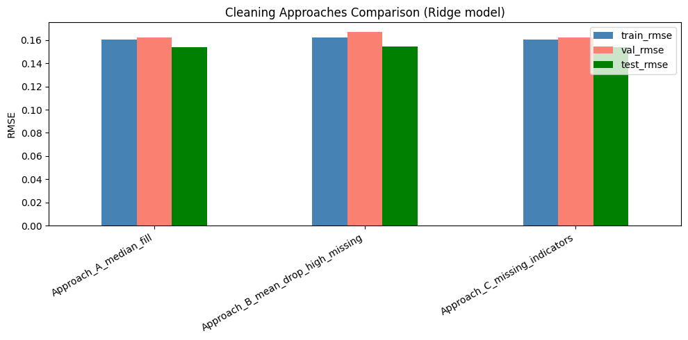
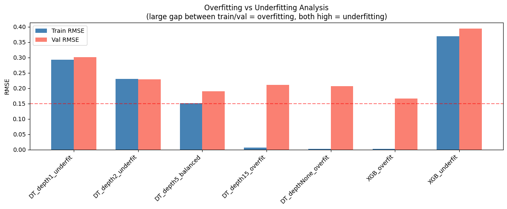
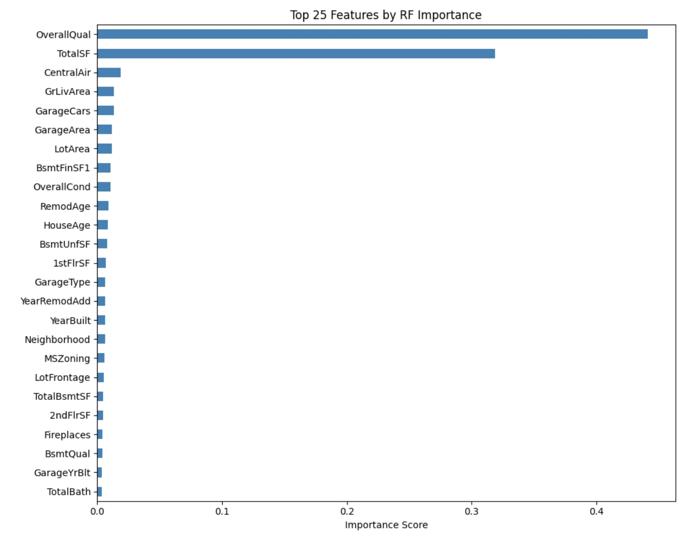
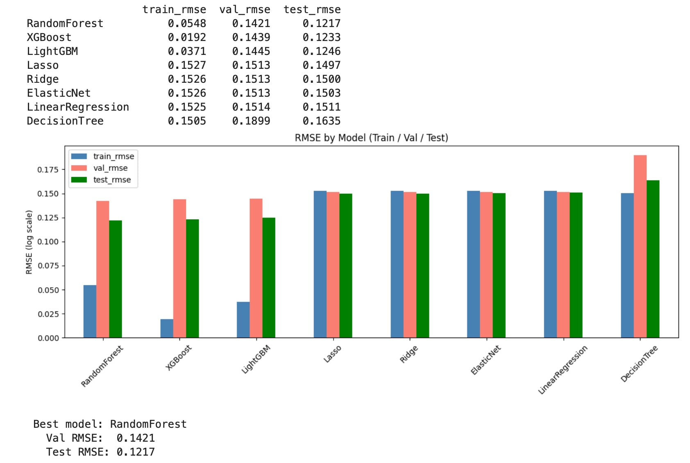
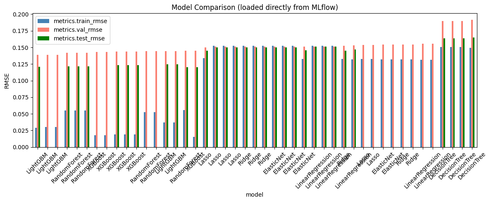

# House Prices – Advanced Regression Techniques
## Kaggle-ის კონკურსის მოკლე მიმოხილვა

მოცემული პროექტი ეფუძნება Kaggle-ის კონკურსს House Prices: Advanced Regression Techniques, რომლის მიზანია საცხოვრებელი სახლების გაყიდვის ფასის პროგნოზირება სხვადასხვა მახასიათებლების საფუძველზე.

Dataset თავიდან შეიცავდა 79 feature-ს, თუმცა Feature Engineering-ის შედეგად დავუმატე ახალი მახასიათებლები და საბოლოოდ გამოყენებულია 83 feature Feature Selection-მდე. ისინი აღწერს სახლების სხვადასხვა ასპექტს, მათ შორის:

    ფიზიკურ მახასიათებლებს (ფართობი, სართულები, ოთახების რაოდენობა)
    ხარისხობრივ მახასიათებლებს (მასალების ხარისხი, მდგომარეობა)
    დროით ფაქტორებს (აშენების წელი, რემონტის წელი)
    მდებარეობასთან დაკავშირებულ ინფორმაციას

კონკურსის შეფასების მეტრიკა არის Root Mean Squared Error (RMSE) ლოგარითმულ სკალაზე, რაც ნიშნავს, რომ მოდელმა უნდა შეძლოს როგორც იაფი, ისე ძვირიანი სახლების ფასის ზუსტი პროგნოზირება.

## მიდგომა პრობლემის გადასაჭრელად

პრობლემის გადასაჭრელად გამოვიყენე მრავალეტაპიანი და სისტემური მიდგომა, რომელიც მოიცავს მონაცემთა დამუშავებას, feature engineering-ს, მოდელების შედარებასა და ჰიპერპარამეტრების ოპტიმიზაციას.

პირველ ეტაპზე განხორციელდა მონაცემთა წინასწარი დამუშავება, რაც მოიცავდა დაკარგული მნიშვნელობების შევსებასა და კატეგორიული ცვლადების რიცხვით ფორმატში გადაყვანას. ამის შემდეგ შეიქმნა ახალი, უფრო ინფორმატიული მახასიათებლები (feature engineering), როგორებიცაა სახლის საერთო ფართობი და ასაკი, რაც დაეხმარა მოდელს უკეთ აღექვა მონაცემებში არსებული დამოკიდებულებები.

შემდეგ ეტაპზე გამოყენებული იქნა feature selection-ის სხვადასხვა მიდგომა, რის შედეგადაც შეირჩა ყველაზე მნიშვნელოვანი მახასიათებლები და შემცირდა მონაცემებში არსებული ე.წ. ,,ხმაური"(noise).

მოდელირების ეტაპზე დაიტესტა სხვადასხვა ალგორითმი, მათ შორის როგორც მარტივი (Linear Regression), ასევე უფრო კომპლექსური მოდელები (Random Forest, XGBoost, LightGBM). განსაკუთრებული ყურადღება დაეთმო overfitting და underfitting შემთხვევების ანალიზს, რათა სწორად შეფასებულიყო მოდელების განზოგადების უნარი.

საბოლოოდ, საუკეთესო შედეგის მისაღებად გამოყენებულია ჰიპერპარამეტრების ოპტიმიზაცია Optuna-ს საშუალებით. ყველა ჩატარებული ექსპერიმენტი დალოგილია MLflow-ში და შენახულია DagsHub-ზე.

# რეპოზიტორიის სტრუქტურა

პროექტის ფაილების სტრუქტურა შემდეგნაირად არის ორგანიზებული:

.
├── model_experiment.ipynb
├── model_inference.ipynb
├── submission.csv
├── README.md
├── .gitignore

## model_experiment.ipynb

ეს არის პროექტის მთავარი notebook, სადაც განვახორციელე:

    მონაცემთა წინასწარი დამუშავება (Cleaning)
    Feature Engineering
    Feature Selection
    სხვადასხვა მოდელების დატესტვა
    overfitting და underfitting ანალიზი
    hyperparameter tuning (Optuna)

ასევე, ყველა ექსპერიმენტი დალოგილია MLflow-ში შესაბამისი მეტრიკებით (train, validation, test RMSE).

## model_inference.ipynb

ეს notebook საჭიროა საუკეთესო მოდელის გამოსაყენებლად:

    ხდება მონაცემთა იგივე preprocessing, რაც training-ის დროს,
    იტვირთება საუკეთესო მოდელი MLflow Model Registry-დან,
    ხდება test set-ზე პროგნოზის გაკეთება,
    გენერირდება საბოლოო submission.csv ფაილი

## submission.csv

ეს ფაილი შეიცავს Kaggle-ზე გასაგზავნ პროგნოზებს: Id, SalePrice

იგი გენერირდება model_inference.ipynb-ის გაშვების შედეგად.

## data_description.txt

შეიცავს dataset-ის სვეტების დეტალურ აღწერას.

## sample_submission.csv

ეს არის Kaggle-ის მიერ მოწოდებული მაგალითი submission ფორმატისთვის.

# Feature Engineering

პროექტში შევქმენი ახალი მახასიათებლები (Feature Engineering), რათა მოდელს უკეთ აღექვა მონაცემებში არსებული დამოკიდებულებები და გაეუმჯობესებინა პროგნოზირების სიზუსტე.

ეს მახასიათებლებია:

TotalSF — სახლის მთლიანი ფართობი (სარდაფი + პირველი სართული + მეორე სართული)
TotalBath — აბაზანების საერთო რაოდენობა (ნახევარი აბაზანის წონით გათვალისწინებით)
HouseAge — სახლის ასაკი გაყიდვის მომენტში
RemodAge — ბოლო რემონტის ასაკი

Feature Engineering-ის შედეგად dataset-ში არსებული feature-ების რაოდენობა გაიზარდა 79-დან 83-მდე.

## Nan მნიშვნელობების დამუშავება

მონაცემებში არსებული დაკარგული მნიშვნელობები (NaN) დავამუშავე შემდეგი სტრატეგიით:

    რიცხვითი ცვლადები: შეივსო შესაბამისი სვეტის მედიანით (median)
    კატეგორიული ცვლადები: შეივსო მნიშვნელობით "None"

ეს მიდგომა უზრუნველყოფს მონაცემთა მთლიანობასა და ამცირებს ინფორმაციის დაკარგვას.

## Cleaning მიდგომები

მონაცემთა გაწმენდის პროცესში განხორციელდა რამდენიმე მნიშვნელოვანი ნაბიჯი:

    -> train და test მონაცემების გაერთიანება ერთ dataframe-ში, რათა preprocessing შესრულებულიყო ერთგვაროვნად
    -> არასაჭირო სვეტების (მაგ. Id) ამოღება
    -> missing values-ის შევსება
    -> ახალი feature-ების დამატება
    -> კატეგორიული ცვლადების encoding

გამოყენებული იქნა 3 განსხვავებული მიდგომა:

    Approach A (საუკეთესო): NaN შევსება მედიანით/None-ით
    Approach B: NaN შევსება საშუალოთი + 50%-ზე მეტი missing მქონე სვეტების წაშლა (Alley, PoolQC, Fence, MiscFeature, MasVnrType)
    Approach C: მედიანით შევსება + დამატებითი binary სვეტები, რომლებიც აჩვენებს სად იყო მნიშვნელობა დაკარგული

შედეგი: Approach A -მ გაიმარჯვა (Val RMSE: 0.1624), Approach B იყო ყველაზე ცუდი (0.1668) — , რადგან სვეტების წაშლამ ინფორმაცია დაკარგა

# Overfitting და Underfitting ანალიზი

სპეციალური ექსპერიმენტები overfitting და underfitting-ის საჩვენებლად:

Underfitting მაგალითები:
- DT_depth1: Train 0.2918, Val 0.3002 — ძალიან მარტივი, ვერ სწავლობს
- XGB_underfit (n_estimators=10): Train 0.3694, Val 0.3935

Overfitting მაგალითები:
- DT_depthNone: Train 0.0000, Val 0.2068 — ზუსტად იმახსოვრებს training data-ს
- XGB_overfit (n_estimators=1000, lr=0.5): Train 0.0006, Val 0.1755

კარგი ბალანსი:
- DT_depth5: Train 0.1505, Val 0.1899

დასკვნა: XGBoost-ს და LightGBM-ს კარგი ჰიპერპარამეტრების გარეშე აქვს overfitting-ის ტენდენცია. Optuna-ს მეშვეობით კი მოხდა ამ პრობლემის გამოსწორება.

# Feature Selection

Feature Selection-ის მიზანია ისეთი მახასიათებლების შერჩევა, რომლებიც ყველაზე მნიშვნელოვან ინფორმაციას შეიცავს და ამავე დროს ამცირებს მონაცემებში არსებულ noise-ს.

საწყის ეტაპზე dataset შეიცავდა 83 feature-ს (Feature Engineering-ის შემდეგ), რის შემდეგაც განხორციელდა მათი შემცირება.

## გამოვიყენე სამი განსხვავებული მიდგომა:

## 1. SelectKBest (F-score)

ამ მეთოდში გამოვიყენე სტატისტიკური ტესტი (f_regression), რომელიც აფასებს თითოეული feature-ის კავშირს სამიზნე ცვლადთან (SalePrice).

შეირჩა Top 25 feature
მეთოდი ეფუძნება მხოლოდ ცვლადებს შორის ხაზოვან დამოკიდებულებას

შეფასება:
ეს მიდგომა მარტივია, თუმცა ვერ იჭერს არაწრფივ (non-linear) დამოკიდებულებებს, რაც ამ dataset-ში მნიშვნელოვანია.

## 2. Correlation-based Selection

ამ მეთოდში გამოვთვალე თითოეული feature-ის კორელაცია target-თან (SalePrice) და შევარჩიე ყველაზე მაღალი აბსოლუტური მნიშვნელობის მქონე 25 feature.

ეფუძნება Pearson correlation-ს
ითვალისწინებს მხოლოდ წრფივ კავშირს

შეფასება:
კორელაცია კარგად აჩვენებს ზოგად ტენდენციას, მაგრამ ვერ ასახავს feature-ებს შორის რთულ ინტერაქციებს.

## 3. Random Forest Feature Importance (საუკეთესო)

ამ მეთოდში გამოყენებულია Random Forest მოდელი, რომელიც აფასებს feature-ების მნიშვნელობას მათი გავლენის მიხედვით პროგნოზზე.

აქაც შეირჩა Top 25 feature მნიშვნელოვნობის მიხედვით
ითვალისწინებს არაწრფივ დამოკიდებულებებს და feature interaction-ებს

შერჩეული მნიშვნელოვანი მახასიათებლები მოიცავს, მაგალითად:

    OverallQual
    TotalSF
    GrLivArea
    GarageCars
    GarageArea
    Neighborhood
    TotalBath
    HouseAge
    RemodAge

შეფასება:
ეს მეთოდი ყველაზე ეფექტური აღმოჩნდა, რადგან ითვალისწინებს მონაცემების რთულ სტრუქტურას და იძლევა უკეთეს შედეგს tree-based მოდელებისთვის.

# Training

მოდელების ტრენინგის პროცესში მონაცემები გავყავი სამ ნაწილად:

Train set: 70%
Validation set: 15%
Test set: 15%

ამ გაყოფის მიზანია მოდელების ობიექტური შეფასება და overfitting-ის თავიდან აცილება.

მოდელები შეფასდა Root Mean Squared Error (RMSE) მეტრიკით ლოგარითმულ სკალაზე.

## ტესტირებული მოდელები 

პროექტში დატესტილია როგორც მარტივი, ისე კომპლექსური მოდელები:

    Linear Regression
    Ridge
    Lasso
    ElasticNet
    Decision Tree
    Random Forest
    XGBoost
    LightGBM

ყველა მოდელი დატრენინგდა ერთსა და იმავე feature-ებზე (RF Importance-ის მიერ შერჩეული 25 feature) და შეფასდა Train, Validation და Test მონაცემების მიხედვით.

## მოდელების შეფასება

მიღებული შედეგები აჩვენებს განსხვავებულ ქცევას სხვადასხვა მოდელებში:

    Linear models (LinearRegression, Ridge, Lasso, ElasticNet):
        აჩვენებენ მსგავს შედეგებს (~0.151 RMSE), რაც მიუთითებს, რომ ვერ იჭერენ მონაცემებში არსებულ რთულ დამოკიდებულებებს → underfitting
    Decision Tree:
         აქვს შედარებით დაბალი train error, მაგრამ მნიშვნელოვნად მაღალი validation error → overfitting
    Random Forest:
        აჩვენებს კარგ ბალანსს train (0.0548) და validation (0.1421) შორის → კარგი generalization
    XGBoost და LightGBM:
        ძალიან დაბალი train error, მაგრამ შედარებით მაღალი validation error → overfitting tendency

### საწყის ეტაპზე საუკეთესო baseline მოდელი გახდა:

 Random Forest (Val RMSE: 0.1421)

## Hyperparameter ოპტიმიზაციის მიდგომა

მოდელების გაუმჯობესებისთვის გამოვიყენე Optuna, რომელიც ავტომატურად ეძებს საუკეთესო ჰიპერპარამეტრებს.

ტუნინგი განხორციელდა შემდეგ მოდელებზე:

    XGBoost
    LightGBM

Optuna-ს საშუალებით მოხდა ისეთი პარამეტრების ოპტიმიზაცია, როგორებიცაა:

    learning rate
    number of estimators
    max depth
    subsampling პარამეტრები

## საბოლოო მოდელის შერჩევის დასაბუთება

Hyperparameter tuning-ის შემდეგ მიღებული შედეგები:

    XGBoost (Tuned):
    Train RMSE: 0.0668
    Validation RMSE: 0.1224
    Test RMSE: 0.1130
    LightGBM (Tuned):
    Validation RMSE: 0.1326

### საბოლოოდ საუკეთესო მოდელი გახდა:

    XGBoost (Optuna Tuned)

### მიზეზები:

    აქვს ყველაზე დაბალი Validation RMSE
    აჩვენებს უკეთეს generalization-ს სხვა მოდელებთან შედარებით
    მნიშვნელოვნად გაუმჯობესდა baseline მოდელთან შედარებით (~0.1439 → 0.1224)
    ოპტიმალურად აბალანსებს bias-variance tradeoff-ს

### დასკვნა

მოდელების შედარებამ და ჰიპერპარამეტრების ოპტიმიზაციამ აჩვენა, რომ:

    მარტივი მოდელები ვერ აღწერს მონაცემების სირთულეს
    რთული მოდელები საჭიროებს tuning-ს overfitting-ის თავიდან ასაცილებლად
    Feature Selection + Hyperparameter tuning ერთად იძლევა საუკეთესო შედეგს

 საბოლოო მოდელი არჩეულია არა შემთხვევით, არამედ დეტალური ექსპერიმენტებისა და ანალიზის საფუძველზე.

# MLflow ექსპერიმენტების მართვა

პროექტში გამოყენებულია MLflow + Dagshub ექსპერიმენტების ტრეკინგისთვის, რაც უზრუნველყოფს ყველა მოდელის შედეგების, პარამეტრების და ექსპერიმენტების სრულად შენახვასა და გამჭვირვალობას.

ყველა ექსპერიმენტი დალოგილია ერთ ცენტრალურ MLflow ექსპერიმენტში:

## MLflow Experiment Link:

https://dagshub.com/mkakh22/house-prices-mlflow.mlflow/#/experiments/0

### ჩაწერილი ექსპერიმენტები

MLflow-ში თითოეული მოდელისათვის ინახება შემდეგი ინფორმაცია:

 1. Model Parameters

დალოგილია ყველა გამოყენებული პარამეტრი:

    Linear models (default hyperparameters)
    Random Forest parameters
    XGBoost / LightGBM hyperparameters
    Optuna-ს მიერ ოპტიმიზებული პარამეტრები (learning rate, depth, subsampling და ა.შ.)

 2. Metrics (შეფასების მეტრიკები)

თითოეული run-ზე დალოგილია:

    train_rmse → მოდელის მორგება training data-ზე
    val_rmse → მთავარი შეფასების მეტრიკა (model selection)
    test_rmse → საბოლოო generalization შეფასება

გამოყენებული მეტრიკა:

    Root Mean Squared Error (RMSE) log-scale-ზე

  3. Models (Artifacts)

MLflow-ში შენახულია:

    trained sklearn models
    XGBoost models
    LightGBM models
    Optuna-tuned final models

ეს საშუალებას იძლევა მოდელის პირდაპირ გადატვირთვა inference ეტაპზე.

## ექსპერიმენტების სტრუქტურა

დალოგილი ექსპერიმენტები მოიცავს:

    -> Baseline models:
        LinearRegression
        Ridge
        Lasso
        ElasticNet
    -> Tree-based models:
        DecisionTree
        RandomForest
        XGBoost
        LightGBM
    -> Tuned models:
        XGBoost (Optuna tuned)
        LightGBM (Optuna tuned)

## საუკეთესო მოდელი

MLflow ექსპერიმენტების მიხედვით საუკეთესო მოდელი გახდა:

 XGBoost (Optuna Tuned)

## შედეგები:
    
    Train RMSE: 0.0668
    Validation RMSE: 0.1224
    Test RMSE: 0.1130

## Kaggle შედეგი

